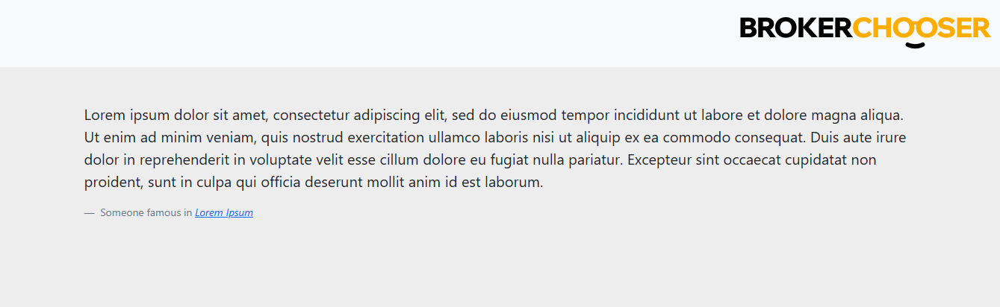
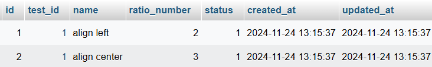
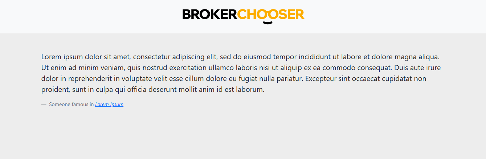
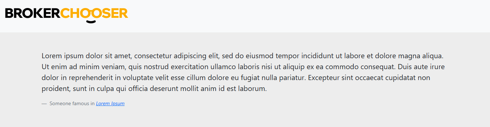
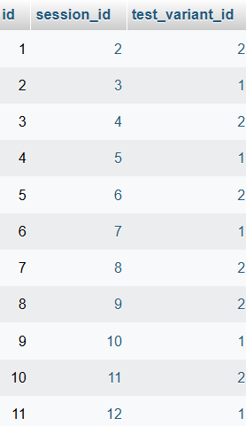
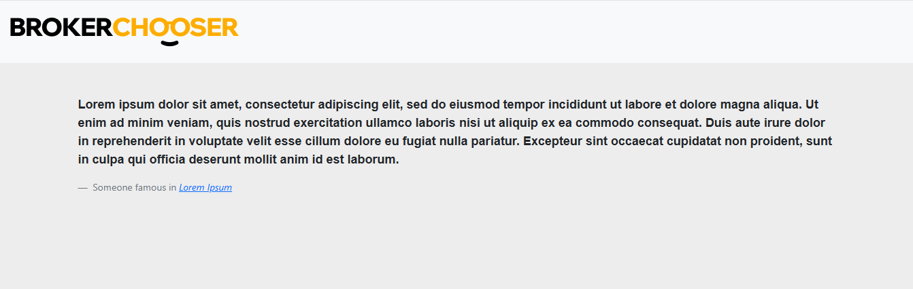
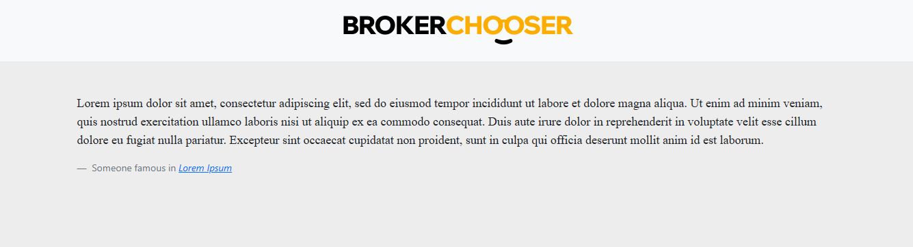
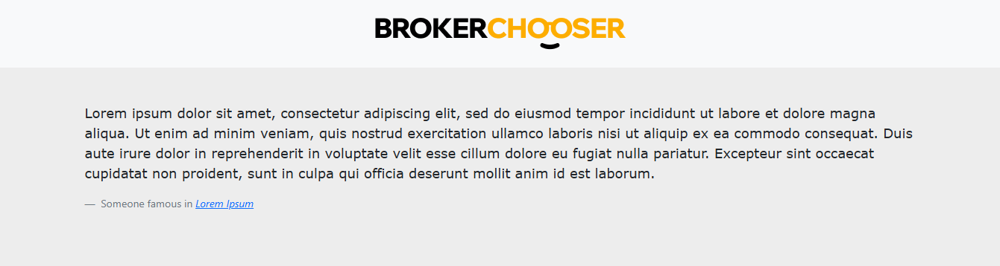
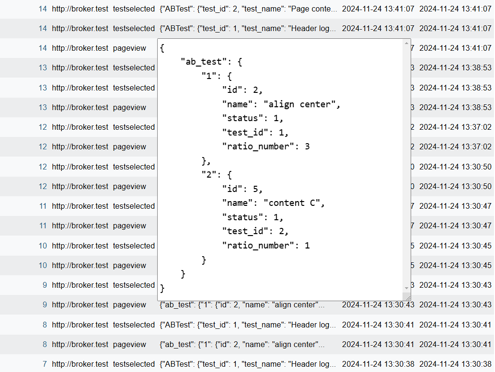

# A / B test homework

I would like to thank the task. It was interesting and I hope my solution will like.

let's see..

## Installation

The database design asked A/B test tables. I created the next tables.

### Migration

- tests
- test_variants
- session_test_variants

For them, you need to run the migration `php artisan migrate` command.

### Seeder

For test data, I created some seeders, wich you can find in `database/seeders` path.
The main seeders name: `ABTestHeaderLogoAlignmentSeeder` and `ABTestPageContentSeeder`.
Them contain the other seeder which will install and contain the test details.

Run the `php artisan db:seed` command.

## Task summary

The process starts from the `StartABTest` middleware. 
It will check to exist tests and test variants. If find, It will run them.

The `TargetingRatioDivisionCalculator` class will choose which test variant the next by before data.

After selecting current test variant
- The software will store it in the `session_test_variants` table.
- Create a new event `testselected` named and it will store details in `data` attribute.
- Save the selected test to session. 
- Finaly, It update, the before `pageview` event and put the selected test variant details to the `data` attribute.

The main page will show the different state while the session contain the test details.

**Every test has a state attribute which default value is `null`. 
It mean, that after you installed the test it will not work currently.  
You need change the state attribute value to work it.**

Test Status:

- `null`: default value, after seeder. 
- `1`: active 
- `0`: disabled

So, you can switch the different status of test.
Of, course test variants has status condition but them just have `0` and `1` exist.

## Under test run

First I show you the default page, without test (Maybe not very flashy).

The test make some manipulation on design. You can check it in `resources/views` path.

### First test 

test variants

selected align center

selected align left

After some display see division

### First and second test

content B

content A

content C

events

I hope you enjoyed it. :)
